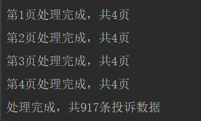
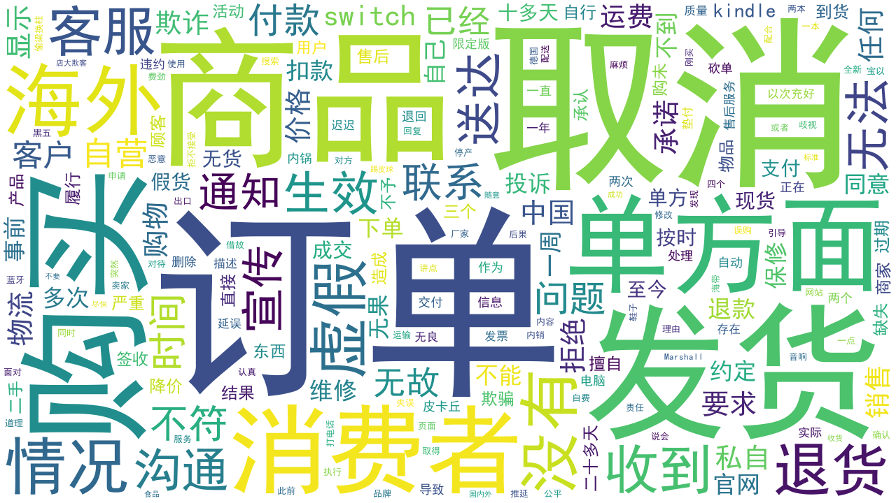

# 企业词云图
>用于分析各公司关键词的工具

## 写在前面

最近在亚马逊购物时，遭遇到了亚马逊擅自取消订单的情况，在进行投诉的过程中，发现很多人遇到了类似的问题，于是萌生了对公司关键词进行分析的想法。

## 实现原理
1.通过[黑猫投诉](https://tousu.sina.com.cn/) 获取用户投诉

2.对投诉结果进行分词

3.根据不同词频绘制出词云图

详细思路可参考[文章](https://blog.csdn.net/steveyg/article/details/86590291)

##使用方式
1.通过git clone或者直接下载源码

2.通过```pip install -r requirement.txt```安装所需依赖

3.输入```python main.py -k keyword```即可查询以keyword为关键词的信息

##运行结果




##注
- 分析所用数据均来自黑猫投诉，解释权归其所有
- 请勿用于商业用途
